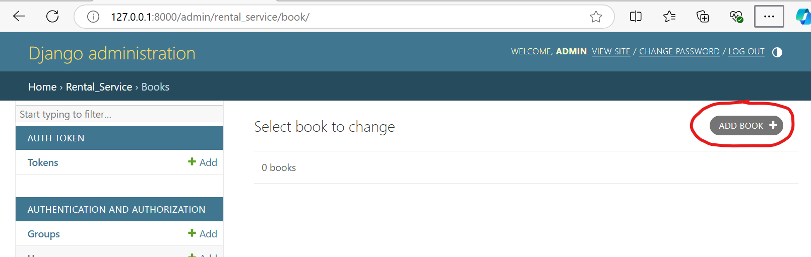
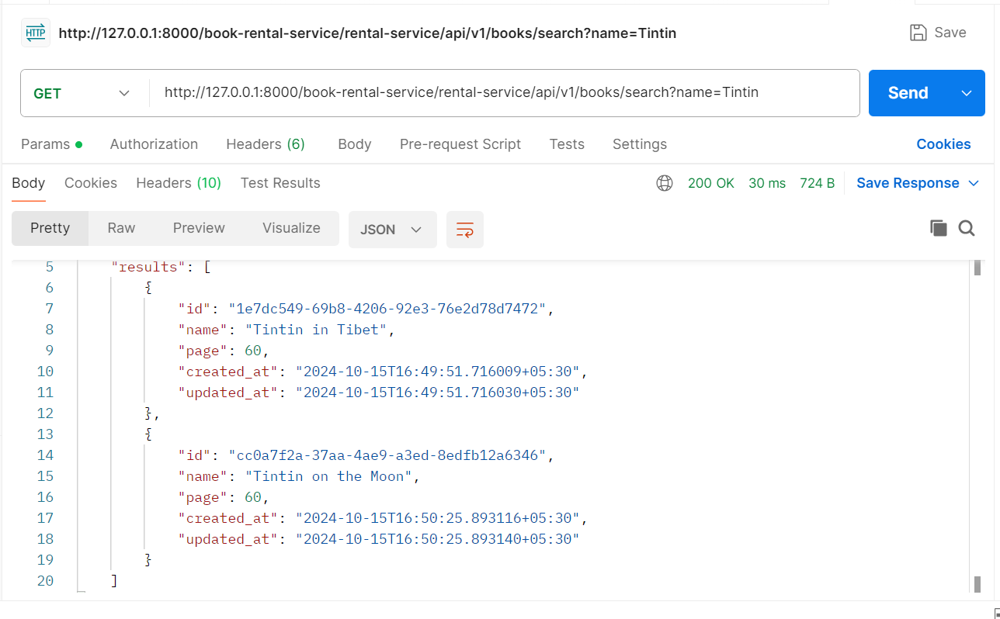
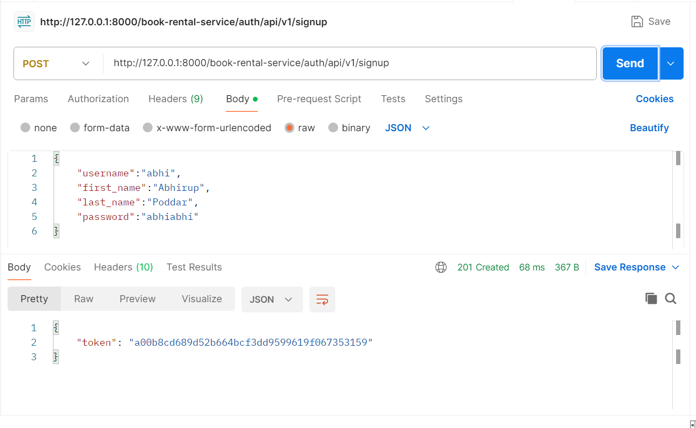
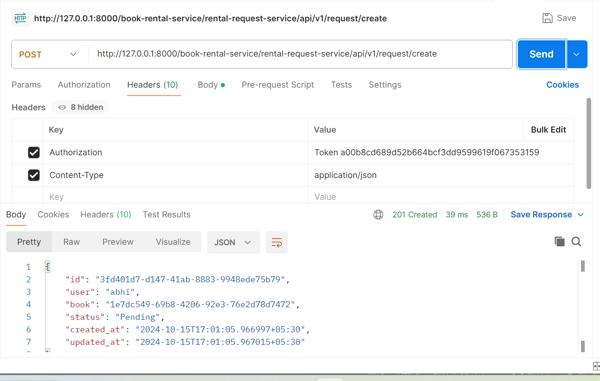
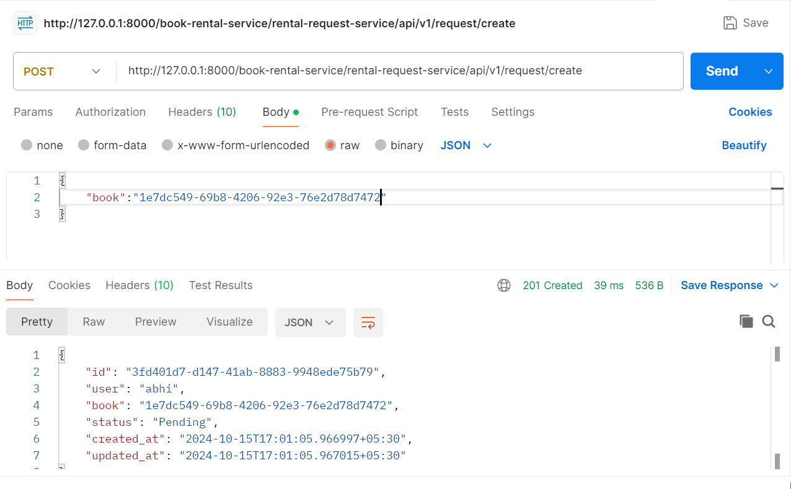
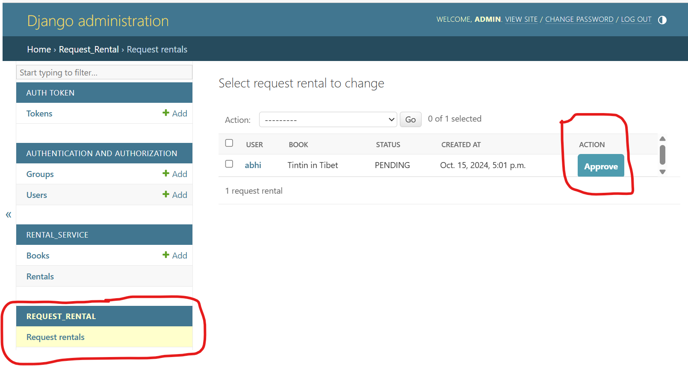
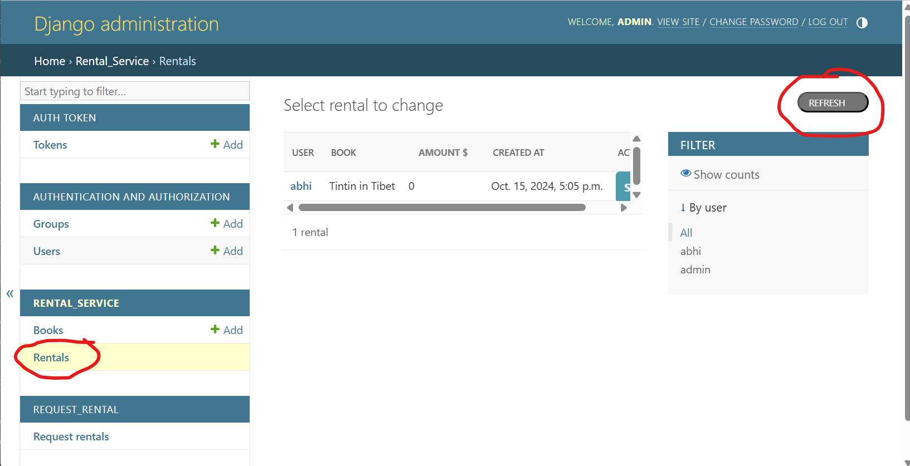
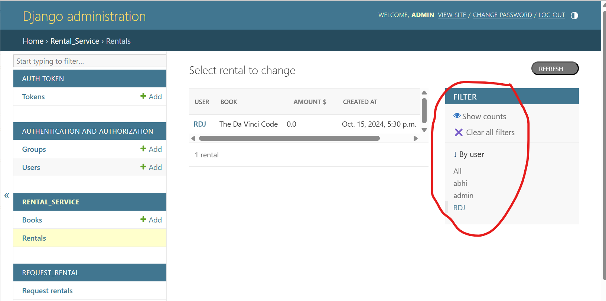
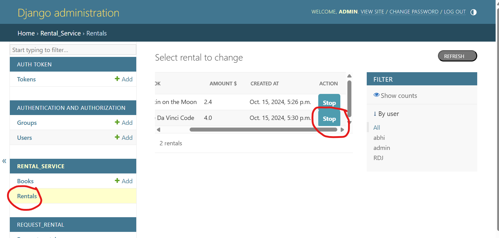
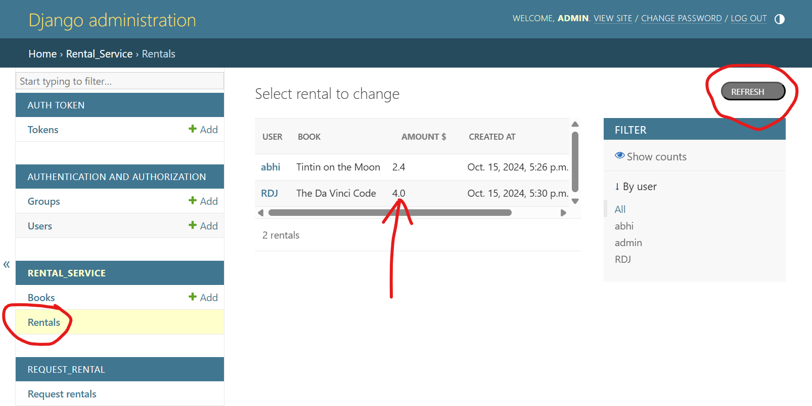

# Book Rental System

## Introduction

Book rental system is a service where end users can rent books from the available lists of books, first month the charges will be completely free but from the subsequent month, the charges will be calculated on the basis of number of pages in the book and number of months passed.

## Overview of Book Rental Features

1. Adding Books: Admins can add a book to the system anytime independent of any other service.
2. Search Books: Users can search books using search API with book name. The book name must not matches with the actual name but the actual name must contain the part of searched name.
3. Users can register into the system using signup API.
4. Registered users can request to rent a book using create request API. This can be done only by the registered users.
5. Admin can approve the rental request from the system dashboard. As soon as admin approves the request, the rental will get start, the rental status will be FREE for first month.
6. Admin can refresh the amounts for charges incurred to the rental, as soon as the rental exceed one month, it will be charged according to the rule for every subsequent months, simultaneously, the status of the Rental will be changed from FREE to PURCHASED.
7. Admin can filter the rentals on users.
8. Admin can stop the rental from the dashboard. Status of the rental will be changed to INACTIVE.

## Getting Started with Book Rental System

1. Clone the repo from the Github
2. Check the .env file in the directory.
      1. .env file must contain 4 environment variables:
        - SECRET_KEY, DEBUG, CURRENCY, TIMEZONE, TIMEUNIT
3. Install docker daemon, as the project will run in container
4. Install Postman to test the APIs (Optional).
5. Open docker daemon
6. Open terminal, go to project directory. run the following command:
      1. docker-compose build
          - this command will install the requirements.txt and and create working directory and will create a local image for the project_book_rental,
          - this command will download the postgres image from dockerhub to the local for use

      2. docker-compose up
          - this command will run the container for image to make the server up and running in local.
          - migrate the database and create the schema accordingly
          - create a superuser if doesn't exists
            - username: admin
            - password: admin
          - load the data from the fixtures
7. In browser, go to http://127.0.0.1:8000/admin and login using admin:admin

## Work with the features of Book Rental System

1. Add a Book:
      - Add a book from Books tab on admin panel.
      
2. Search books:
      - Search for books by name from search API
      - method: GET
      - endpoint: http://127.0.0.1:8000/book-rental-service/rental-service/api/v1/books/search?name=Book
      - response: 200 OK- A list of books
      
3. Register:
      - User register into system by signup API.
      - endpoint: http://127.0.0.1:8000/book-rental-service/auth/api/v1/signup
      - method: POST
      - body: { "username": "<username>", "firstname": "<firstname>", "lastname": "<lastname>", "password": "<password>" }
      - headers: Content-Type: application/json
      - response: 201 Created- An user token
      
4. Request to Rent a book:
      - User request to rent an available book using create request API. Use the same token in headers to get the job done
      - endpoint: http://127.0.0.1:8000/book-rental-service/rental-request-service/api/v1/request/create
      - method: POST
      - headers: Authorization: Token <token>, Content-Type: application/json
      - body: { "book": "<book_id>"}
      
      
5. Approve the rental request:
      - Admin approve the rental request from Request Rental tab in admin panel
      
6. Refresh the rentals:
      - Admin can refresh/update the rental details from Rental tab in admin panel
      
7. Filter the rentals:
      - Admin can filter the rentals by user:
      
7. Stop the rental:
      - Admin can stop or make the rental inactive from Rental tab in admin panel
      
8. Amount calculation:
      - Whenever admin refreshes or stop any rental, automatically rental details including amount will be calculated
      

## Important:
1. we should not push the local .env file to Git Repo, that should be used for local work. But here, it has been pushed for the reference, we can push one file .env.copy with the variable names without values

2. Here .env variable TIMEUNIT value must be "Month" or "Minute". This has been done to adjust the same property between 'large scale: Month' and 'small scale: Minute'. If the requirement is in month, to test it in local, we can test using TIMEUNIT=Minute.
